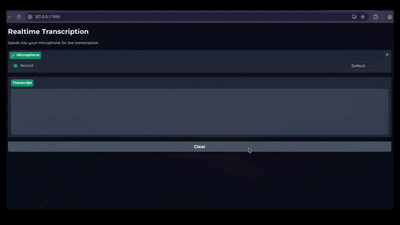

# Realtime Transcription

Gradio web interface for real-time speech-to-text transcription from your microphone.



## What You'll Learn

- Build a web UI for live transcription
- Stream microphone audio through WebSocket
- Display live transcription results

## Setup

```bash
export SMALLEST_API_KEY="your-api-key-here"
```

## Usage

```bash
pip install gradio websockets librosa numpy
python app.py
```

Open http://localhost:7860 in your browser.

## How to Use

1. Enter your API key
2. Click the microphone button to start recording
3. Speak - transcription appears in real-time
4. Click "Clear" to reset the transcript
