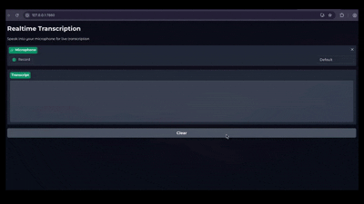

# Realtime Microphone Transcription

Gradio web interface for real-time speech-to-text transcription from your microphone.

## Demo



## Features

- Web UI for live transcription powered by Gradio
- Stream microphone audio through WebSocket in real-time
- Display live transcription results as you speak

## Requirements

> Base dependencies are installed via the root `requirements.txt`. See the [main README](../../../README.md#usage) for setup. Add `SMALLEST_API_KEY` to your `.env`.

Extra dependencies:

```bash
uv pip install -r requirements.txt
```

This installs `numpy` (gradio is already in the root install).

## Usage

```bash
uv run app.py
```

Open http://localhost:7860 in your browser.

1. Click the microphone button to start recording
2. Speak — transcription appears in real-time
3. Click stop to end the session

## Recommended Usage

- Visual web interface for live microphone transcription — great for demos and prototyping
- Quick testing of Pulse STT with real-time audio
- For a full voice assistant with LLM and TTS, [Jarvis](../jarvis/) is recommended

## How It Works

The Gradio app captures microphone audio, streams it via WebSocket to Pulse STT, and displays interim and final transcripts in real-time. The WebSocket connection is managed using `websockets.sync.client` for thread compatibility with Gradio.

## API Reference

- [Streaming Quickstart](https://waves-docs.smallest.ai/models/speech-to-text/realtime-web-socket/quickstart)
- [Pulse STT WebSocket API](https://waves-docs.smallest.ai/api-reference/models/speech-to-text/speech-to-text)

## Next Steps

- [Jarvis Voice Assistant](../jarvis/) — Full assistant with wake word detection, LLM, and TTS
- [Streaming Transcription](../streaming-text-output-transcription/) — Stream audio files via WebSocket
