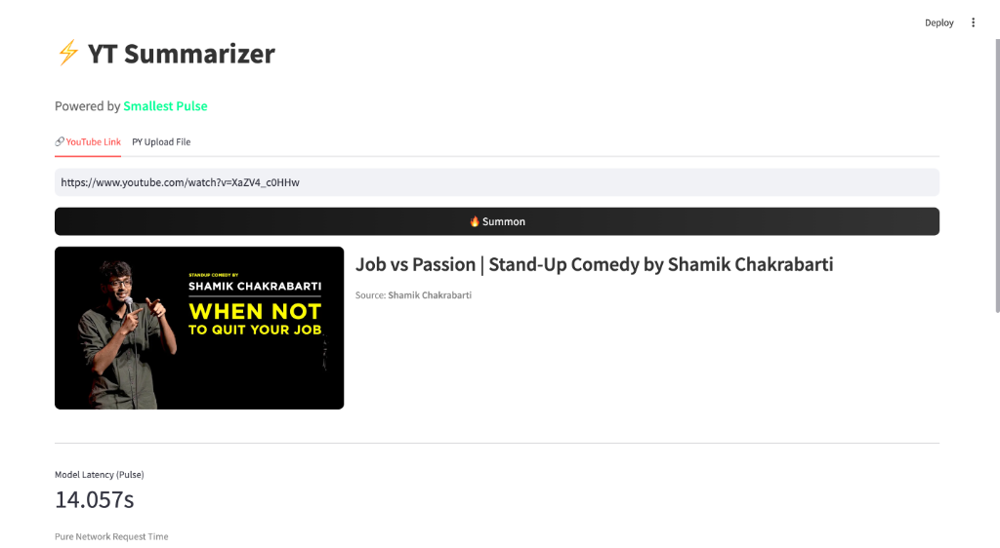

# YouTube Summarizer



A lightning-fast tool to transcribe and summarize YouTube videos or uploaded audio files. Powered by **Smallest AI Pulse** for ultra-low latency transcription and **Groq** for instant summarization.

## Features

- **Pure Speed**: Leverages Pulse STT for sub-200ms transcription latency
- **Smart Summaries**: Uses Groq (Llama 3) to extract executive summaries and key takeaways
- **Flexible Input**: Supports both YouTube URLs and direct file uploads (MP3, MP4, WAV)
- **Latency Metrics**: Visualizes the precise time taken for STT (Network) vs LLM (Processing)

## Requirements

> Base dependencies are installed via the root `requirements.txt`. See the [main README](../../README.md#usage) for setup. Add `SMALLEST_API_KEY` and `GROQ_API_KEY` to your `.env`.

Extra dependencies:

```bash
uv pip install -r requirements.txt
```

## Usage

```bash
uv run streamlit run app.py
```

## Recommended Usage

- Visual web app for quickly transcribing and summarizing YouTube videos
- Comparing STT vs LLM latency with built-in speed metrics
- For CLI-based summarization of podcast files, [Podcast Summarizer](../podcast-summarizer/) is recommended

## How It Works

1. **Extraction**: `yt-dlp` extracts audio from the YouTube video (or reads uploaded bytes)
2. **Transcription**: **Pulse STT** receives the raw audio stream and returns text in milliseconds
3. **Analysis**: **Groq** processes the transcript to generate a structured summary and "Value Density" score
4. **Display**: Results are rendered instantly with a focus on speed metrics

## Supported Formats

- **YouTube Links**: Standard Video URLs
- **Uploads**: MP3, WAV, M4A, MP4, MOV

## Customization

You can modify `process_pulse_metadata` to re-enable paralinguistic features (Age, Gender, Emotion) if needed, which Pulse supports natively.

## API Reference

- [Pulse STT API Reference](https://waves-docs.smallest.ai/api-reference/models/speech-to-text/transcribe)
- [Groq API Docs](https://console.groq.com/docs/api-reference)

## Next Steps

- [Podcast Summarizer](../podcast-summarizer/) — CLI-based transcribe-and-summarize with GPT-5
- [Streaming Transcription](../websocket/streaming-text-output-transcription/) — Stream audio via WebSocket for real-time results
